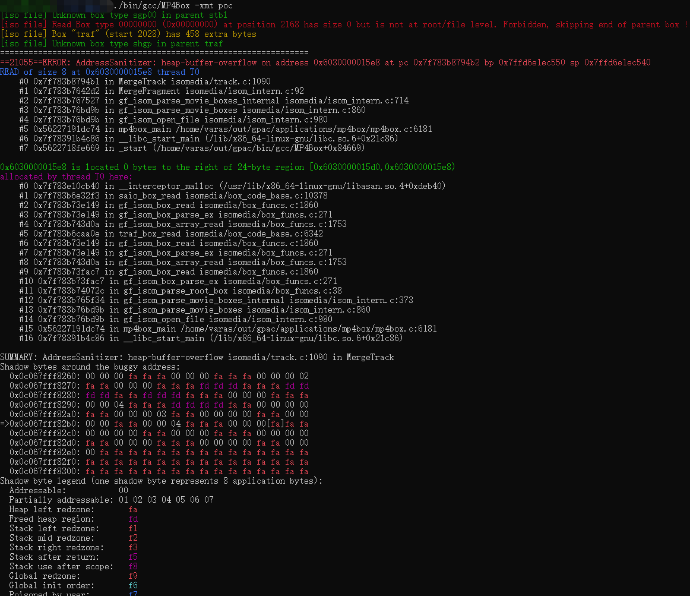

# Heap Buffer Over-Read by out of bounds index of array

Software: gpac

Vuln Version:  MP4Box - GPAC version 2.1-DEV-rev257-g7360c7ed9-master

Download Link: https://github.com/gpac/gpac

Description: MP4Box can transfer different multimedia file format.A heap buffer over-read bug was found in track.c:1090 because of the out of bounds index of array 'offset',  which may cause information leaking.

## Trigger Screen-Shot

Waiting for official confirmation：https://github.com/gpac/gpac/issues/2240

