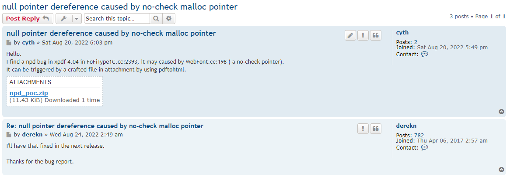

# Null-Pointer-Dereference by no-check molloc pointer

Software: xpdf

Vuln Version: 4.04

Download Link: http://www.xpdfreader.com/download.html

Description: The Xpdf open source project includes a PDF viewer along with a collection of command line tools which perform various functions on PDF files. Pdftohtml converts PDF to HTML. A null-pointer-dereference bug was found in in xpdf 4.04 in function convertToOpenType() at ./fofi/FoFiType1C.cc:2393, which causes a Denial of Service(DoS). 

## Official confirmation

